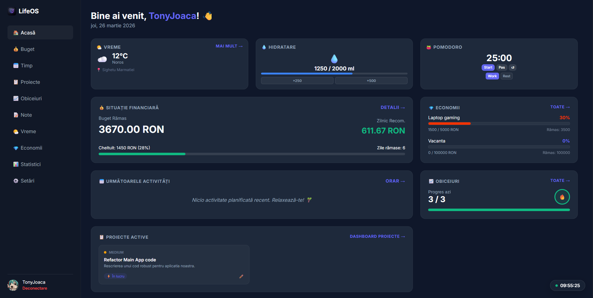

# LifeOS - Atestat Informatică (Clasa a XII-a)

**LifeOS** este o aplicație web de tip "Personal Assistant" care integrează gestiunea bugetului personal și planificarea timpului într-o interfață modernă și prietenoasă.



## 🚀 Funcționalități

### 🔐 Autentificare
- Sistem de Login & Înregistrare securizat.
- Sesiuni persistente.
- Opțiune pentru conturi de Administrator.

### 💰 Modul Economic (Buget Avansat)
- Setarea bugetului lunar și adăugarea de fonduri.
- **Categorii Personalizate**: Adăugarea cheltuielilor pe categorii (Mâncare, Transport, etc.).
- **Limite Lunare**: Setarea de praguri valorice pe fiecare categorie cu alerte vizuale (⚠️) la depășire.
- **Vizualizare Grafică**: Diagramă (Doughnut Chart) grupată pe categorii.
- Calcul automat al bugetului zilnic recomandat.

### 📅 Modul Time Management (Orar)
- Calendar săptămânal interactiv cu evidențierea zilei curente.
- Adăugare activități:
  - **Fixe** (Ex: "Teză" pe 20 Mai la 10:00).
  - **Recurente** (Ex: "Antrenament" în fiecare Luni la 18:00).
- Sistem de finalizare a activităților (Terminat ✓) cu ștergere temporizată.

### 📋 Modul Productivitate (Kanban & Obiceiuri)
- **Kanban Board**: Gestionarea proiectelor complexe prin coloane (De făcut, În lucru, Finalizat) cu funcționalitate Drag-and-Drop și **căutare în timp real**.
- **Habit Tracker**: Monitorizarea obiceiurilor zilnice cu sistem de **🔥 Streaks** (zile consecutive) pentru motivare.
- **Notes**: Sistem de notițe rapide cu prioritizare pe culori, auto-salvare drafturi și filtrare rapidă.
- **Widget Dashboard**: Vizualizarea rapidă a task-urilor active și a progresului obiceiurilor direct pe pagina principală.

### ✨ Personalizare și QoL (Power User)
- **Tema Duală**: Comutare rapidă între **Light Mode** și **Dark Mode** pentru o experiență vizuală adaptată.
- **Accent Color Picker**: Personalizarea culorii principale a întregii interfețe.
- **Scurtături de Tastatură**: `Alt+N` (Notă), `Alt+T` (Task), `Alt+F` (Căutare), `Esc` (Modale).
- **Export Date**: Salvgardarea întregii baze de date (JSON) sau a istoricului financiar (CSV/Excel).
- **Design Modern**: Animații de tip Skeleton Loaders și efecte de Confetti la finalizarea obiectivelor.

## 🛠️ Tehnologii Utilizate

- **Backend**: Node.js, Express.js, SQLite3.
- **Frontend**: HTML5, CSS3 (Glassmorphism), JavaScript Vanilla.
- **Librării**:
  - `chart.js` - Pentru grafice.
  - `flatpickr` - Pentru selectorul de dată/oră.
  - `bcrypt` - Pentru securitatea parolelor.
- **Design**: Google Fonts (Inter), CSS Grid/Flexbox.

## 📦 Instalare și Rulare

1.  Clonează repository-ul:
    ```bash
    git clone https://github.com/user/LifeOS.git
    cd LifeOS
    ```

2.  Instalează dependențele:
    ```bash
    npm install
    # sau
    pnpm install
    ```

3.  Pornește serverul:
    ```bash
    npm run start
    # sau pentru dezvoltare
    npm run dev
    ```

4.  Deschide browserul la `http://localhost:3000`.

## 📄 Documentație
Pentru detalii tehnice complete, consultă fișierele din folderul rădăcină:
- [Documentație Proiect](DOCUMENTATIE_PROIECT.md) - Descriere generală.
- [Documentație Cod](DOCUMENTATIE_COD.md) - Detalii de implementare.

---
Proiect realizat pentru Atestatul de Competențe Profesionale la Informatică.
